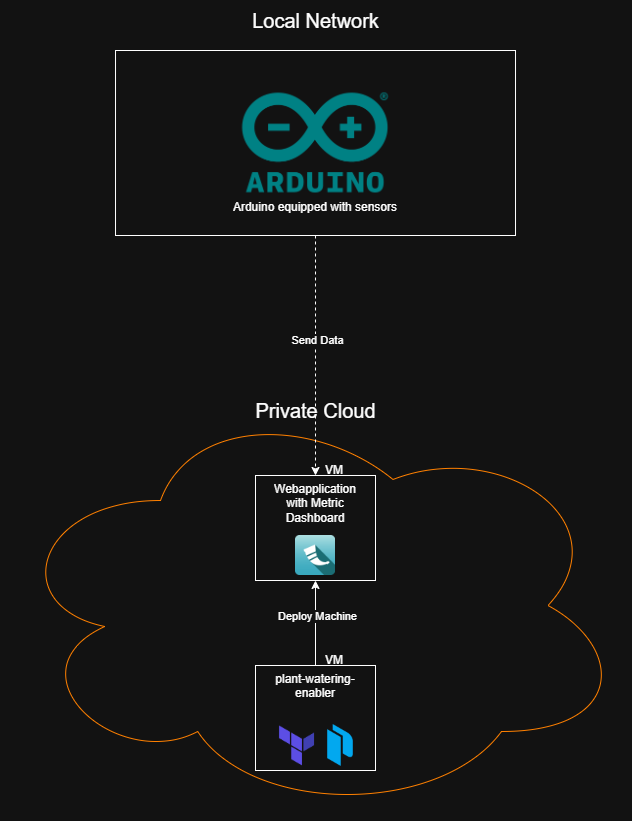

# plant-watering-enabler
This is a subproject of "Eggplanter". Eggplanter is a school project, where the task was to think up a concept involving IOT.  
There is absolutely no meaning behind any of the names we assigned to these projects whatsoever.

This specific repository was created with the purpose of automatically deploying the [webapplication](https://github.com/aznaveeck/eggplanter-website) supplied by [@aznaveeck](https://github.com/aznaveeck).  
It does not enable a plant to be watered in any shape or form.

## Birds-Eye Project Overview
>This is where this project fits in within our entire project "Eggplanter"



## Project Workflow

<details>

<summary>1. Build VM template</summary>
We build the VM template with Packer.
This is done on a pre-existing VM with Packer installed.

The contents are stored in the `template` folder.

Run the following commands:  
```
packer init .
packer build .
```

</details>

<details>

<summary>2. Create VM from template</summary>
We create the VM by cloning the template generated by packer, using Terraform.
This is done on a pre-existing VM with Terraform installed.

The contents are stored in the `deployment` folder.

Run the following commands:  
```
terraform init .
terraform plan
terraform apply
```

</details>
