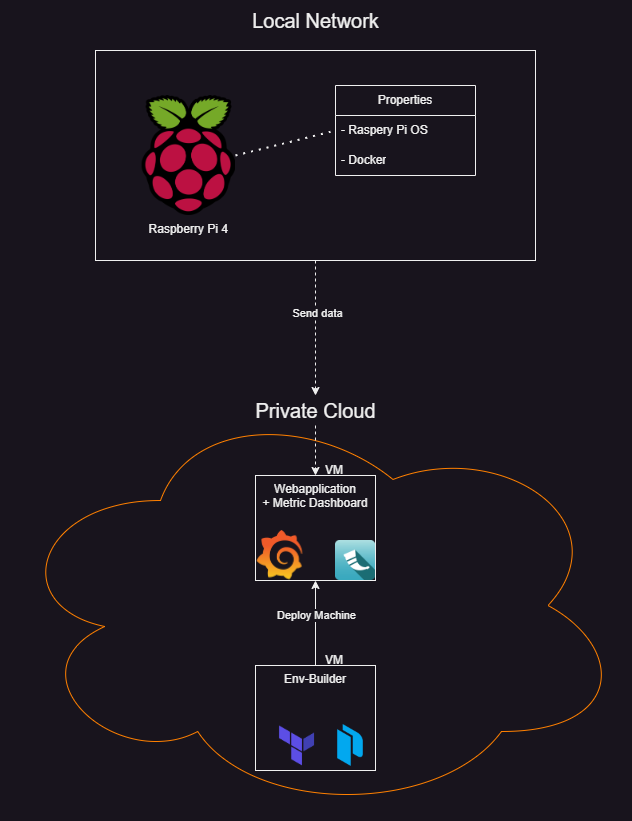

# Env-Builder

## Birds-Eye Project Overview
>This is where this project fits in with our entire project "Eggplanter"

## In-Depth Project Overview

## Project Workflow

1. Build VM template

We build the VM template with Packer.
This is done on a pre-existing VM with Packer installed.

The contents are stored in the `template` folder.

2. Create VM from template
